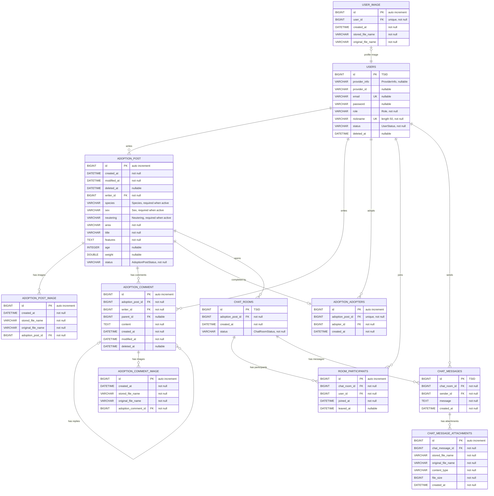

# ERD

이 문서는 현재 `src/main/java/com/sns/marigold` 아래 JPA `@Entity` 기준으로 작성했습니다.

실제 운영 DB 스키마와 동기화를 보장하지 않고 있으므로, 실제와 다소 차이가 있을 수 있습니다.

## Mermaid

## 제약 및 인덱스

| 테이블 | 제약/인덱스 | 내용 |
| --- | --- | --- |
| `users` | unique | `email`, `nickname`, `(provider_info, provider_id)` |
| `user_image` | unique | `user_id` |
| `adoption_post` | check | `deleted_at IS NOT NULL OR (species IS NOT NULL AND sex IS NOT NULL AND neutering IS NOT NULL)` |
| `adoption_adopters` | unique | `adoption_post_id` |
| `room_participants` | unique | `uk_room_participant_room_user(chat_room_id, user_id)` |
| `room_participants` | index | `idx_user(user_id)` |
